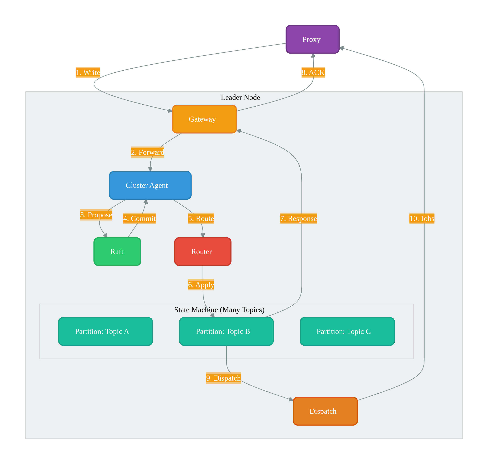
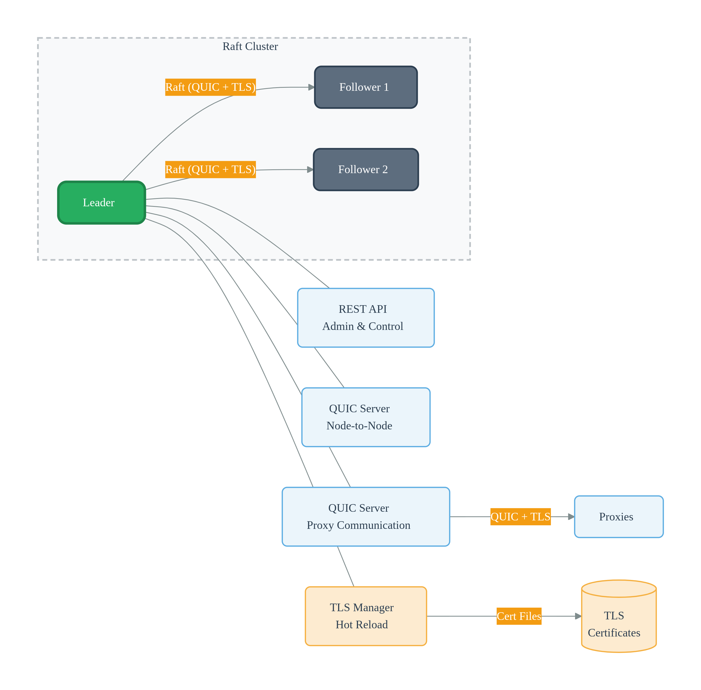

# Cue Overview

**Cue** is a distributed, in-memory job queue with strong consistency via Raft.

## Architecture

{: .cluster-diagram }

---

## Key Concepts

### Partition Management
- Every node holds **all partitions (topics) in memory**
- No snapshots - state is fully in-memory only
- Partitions are not persisted to disk beyond the WAL

### Consistency
- **Raft** ensures linearizable consistency across the cluster
- All writes go through the leader
- Raft handles leader election and log replication

### Durability
- **Write-Ahead Log (WAL)** for durability
- Segmented WAL files for each partition
- **Truncation behavior:**
  - WAL is truncated **periodically** up to the oldest job that received ack or moved to DLQ
  - After **max retries with exponential backoff**, job moves to DLQ
  - Result: **WAL files are always limited** - never grow unbounded
  - No snapshots needed since WAL is continuously truncated

### Reliability
- **Automatic retries** with exponential backoff
  - Jobs are retried on failure
  - Backoff prevents thundering herd
- **Dead Letter Queue (DLQ)** for failed jobs
  - After max retries exhausted
  - Jobs move to DLQ for manual inspection
  - WAL is then truncated for that segment

### Summary

| Concept | Implementation |
|---------|---------------|
| **State** | In-memory only - no snapshots |
| **Durability** | WAL with segmented files |
| **Truncation** | Periodically, up to a safe index|
| **Retries** | Exponential backoff |
| **Failed Jobs** | DLQ after max retries |
| **WAL Size** | Always limited - continuously truncated |

---

## Cluster Node Components

### Gateway
- Dedicated **QUIC server** for proxy communication
- Own **TLS certificate files** (can be separate from cluster certs)
- Handles all external requests from proxies
- Routes requests to internal components

### Cluster Agent
- Manages **node-to-node communication**
- Dedicated **QUIC client/server** for cluster internal traffic
- Can use **separate certificate files** or share the same certs as gateway
- Handles Raft peer communication and cluster membership

### Raft Layer
- Core **consensus engine** for the cluster
- **Shared storage** for Raft logs
- **Decoupled** from partitions - partitions don't manage Raft directly
- Handles leader election, log replication, and consistency

### Partitions & Routers
- **Router** directs requests to the correct partition based on topic
- **Partitions** are the state machines for each topic
- Each partition maintains its own **in-memory state**
- Partitions apply committed entries from Raft

### API Server
- REST API for **admin and control** operations
- Health checks, cluster status, monitoring endpoints
- Prometheus metrics endpoint

---

### Communication Matrix

| Component | Protocol | TLS | Purpose |
|-----------|----------|-----|---------|
| **Gateway** | QUIC | Own certs | Proxy communication |
| **Cluster Agent** | QUIC | Shared/separate certs | Node-to-node |
| **Raft** | RPC | Via Cluster Agent | Consensus |
| **API Server** | HTTP/REST | Optional | Admin |

---

{: .cluster-diagram }

---