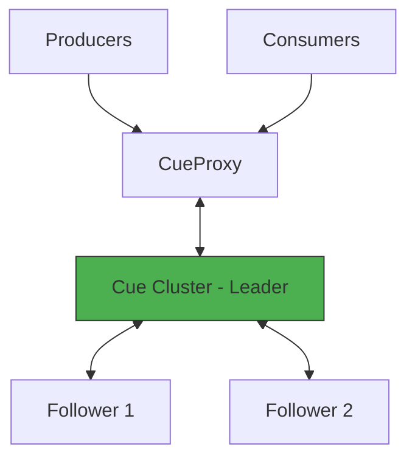

# Cue Overview

**Cue** is a distributed, in-memory job queue with strong consistency via Raft.

## Architecture

### Key Concepts

- Every node holds all partitions (topics) in memory
- Raft ensures linearizable consistency across the cluster
- Write-Ahead Log (WAL) for durability
- Automatic retries with exponential backoff
- Dead Letter Queue (DLQ) for failed jobs

**CueProxy** acts as the stateless gateway for external communication.

---