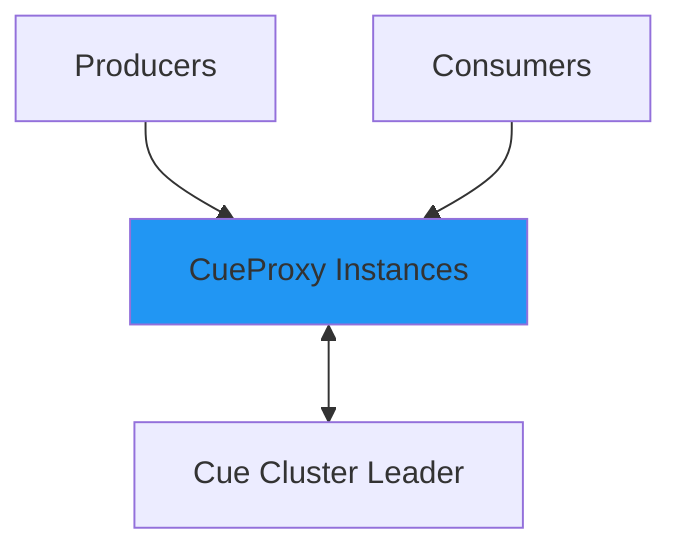

# CueProxy Overview

**CueProxy** is the stateless HTTP and WebSocket gateway for Cue.

## Architecture

- Completely stateless & horizontally scalable
- Handles authentication, load balancing, and backpressure
- Proxies communicate with Cue via QUIC

---

