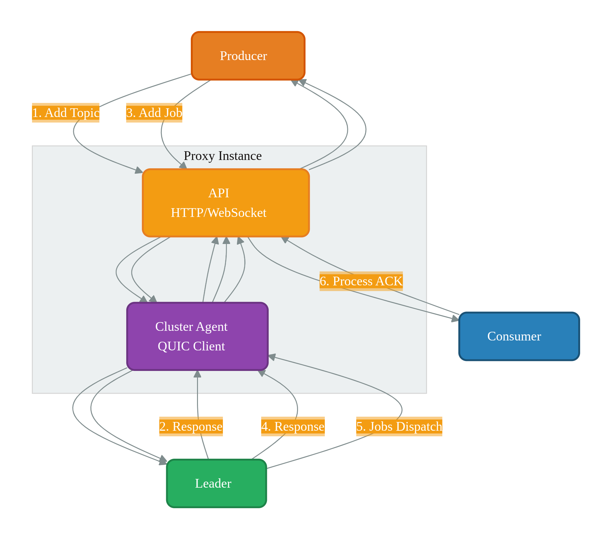

# CueProxy Overview

**CueProxy** is the stateless HTTP and WebSocket gateway for Cue.

- Completely stateless & horizontally scalable
- Handles authentication, load balances outflow to consumers subscribed to a topic, and applies backpressure
- Proxies communicate with Cue via QUIC

---

### Architecture

{: .proxy-diagram }

---

### Proxy Components and Flows

#### 1. Producer Add Topic Flow (Synchronous)

| Step | Direction | Action | Protocol |
|------|-----------|--------|----------|
| 1 | Producer → API | Send add topic request | HTTP |
| 2 | API → Cluster Agent | Forward request | Internal |
| 3 | Cluster Agent → Leader | Propose topic creation | QUIC |
| 4 | Leader → Cluster Agent | Topic created response | QUIC |
| 5 | Cluster Agent → API | Pass response back | Internal |
| 6 | API → Producer | Return success/failure | HTTP |

---

#### 2. Producer Add Job Flow (Synchronous)

| Step | Direction | Action | Protocol |
|------|-----------|--------|----------|
| 1 | Producer → API | Send add job request | HTTP |
| 2 | API → Cluster Agent | Forward request | Internal |
| 3 | Cluster Agent → Leader | Propose write to Raft | QUIC |
| 4 | Leader → Cluster Agent | Job committed response | QUIC |
| 5 | Cluster Agent → API | Pass response back | Internal |
| 6 | API → Producer | Return ACK | HTTP |

---

#### 3. Consumer Subscribe & Job Dispatch Flow (Asynchronous)

| Step | Direction | Action | Protocol |
|------|-----------|--------|----------|
| 1 | Consumer → API | Subscribe to topic | WebSocket |
| 2 | API → Consumer | Subscription confirmed | WebSocket |
| 3 | Leader → Cluster Agent | Dispatched jobs | QUIC |
| 4 | Cluster Agent → API | Pass jobs | Internal |
| 5 | API → Consumer(s) | Deliver job (load balanced by topic) | WebSocket |
| 6 | Consumer → API | Process ACK | WebSocket |

---
