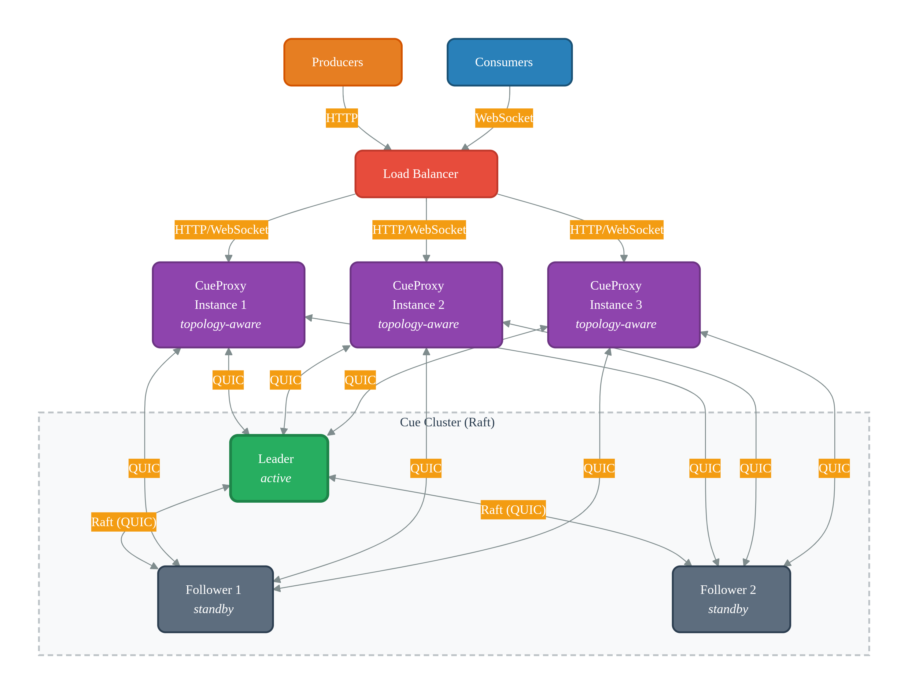

# Cue Documentation

**Cue** is a distributed, in-memory job queue with Raft-based consistency, automatic retries, and dead letter handling.

It is designed for teams that need **reliable job dispatch** without operating complex infrastructure like Kafka.

## Core Components

- **[Cue](./cue/overview.md)** — The distributed cluster (3/5/7 nodes)
- **[CueProxy](./cueproxy/overview.md)** — Stateless HTTP & WebSocket gateway

## Architecture

{: .cluster-diagram }

---

## What Cue Guarantees

- No job loss (Raft WAL survives total cluster crash)
- At-least-once delivery (duplicates possible, idempotent consumers required for exactly-once)
- Automatic retries with exponential backoff
- Dead letter file with rotation
- Bounded queues with clear backpressure

## What Cue Does Not Guarantee

- Infinite queue size
- Exactly-once without client idempotency

## The Honest Promise

Cue is simple to operate, bounded by design, and honest about its limits. Teams that need Kafka's endless persistence should use Kafka. Teams that need Redis Pub/Sub's fire-and-forget should use Redis. Teams that need an in-memory, durable, retrying job queue with straightforward operations should use Cue.

---

## Quick Links

- [Quick Start](./quickstart.md)
- [Cue GitHub](https://github.com/m-javani/cue)
- [CueProxy GitHub](https://github.com/m-javani/cue-proxy)
- [Benchmarking](benchmark.md) - Test system performance

---
